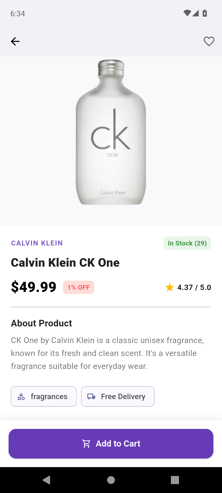
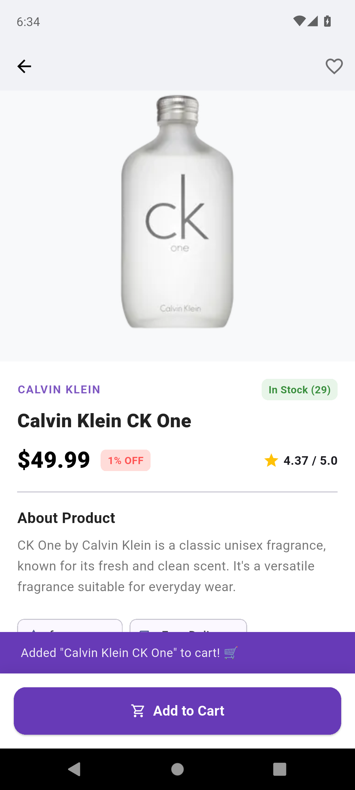
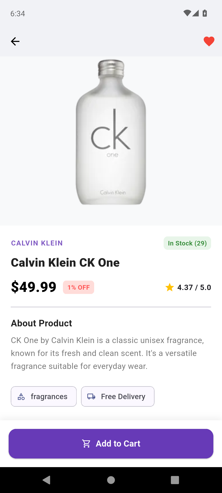
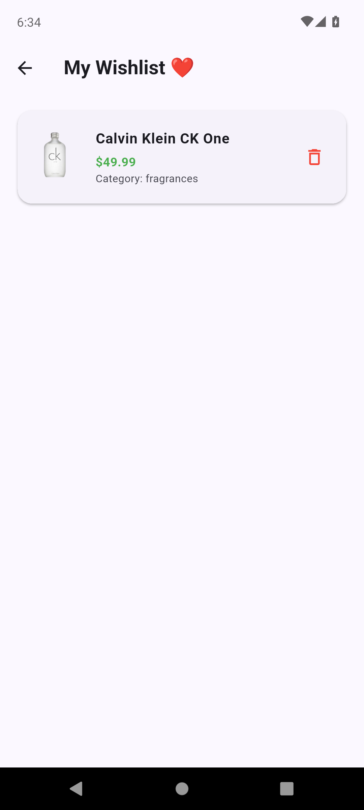

# 🛍️SirjanStore-- An intern project

A modern, responsive e-commerce mobile application built with **Flutter**, featuring **Clean Architecture**, **BLoC Pattern**, **Dependency Injection**, and the **Repository Pattern**.

---

## 📱 Screenshots

| Home Screen & Search | Product Details | Wishlist / Favorites |
| :---: | :---: | :---: |
|  |  |  |   |  |

##  Features
-  Live Product Catalog:    Fetches dynamic product listings via [DummyJSON API](https://dummyjson.com/products).
-  Real-Time Search & Filtering:   Instant client-side search query matching and category chips filtering.
-  Global Wishlist / Favorites:   Add/remove items with state synchronized across all screens.
-  Product Details Page:       Stock availability badges, discount tags, rating indicators, and interactive cart button.
-  Responsive Grid Layout:     Adapts automatically to mobile (2 columns) and desktop/web (4 columns).

---

## 🏛️ Architecture & Tech Stack

- **Architecture:** Clean Architecture (Domain, Data, and Presentation layers)
- **State Management:** BLoC Pattern (`flutter_bloc` & `equatable`)
- **Dependency Injection:** Service Locator with `get_it`
- **Network / API:** `http` package fetching from DummyJSON REST API
- **Design System:** Material 3